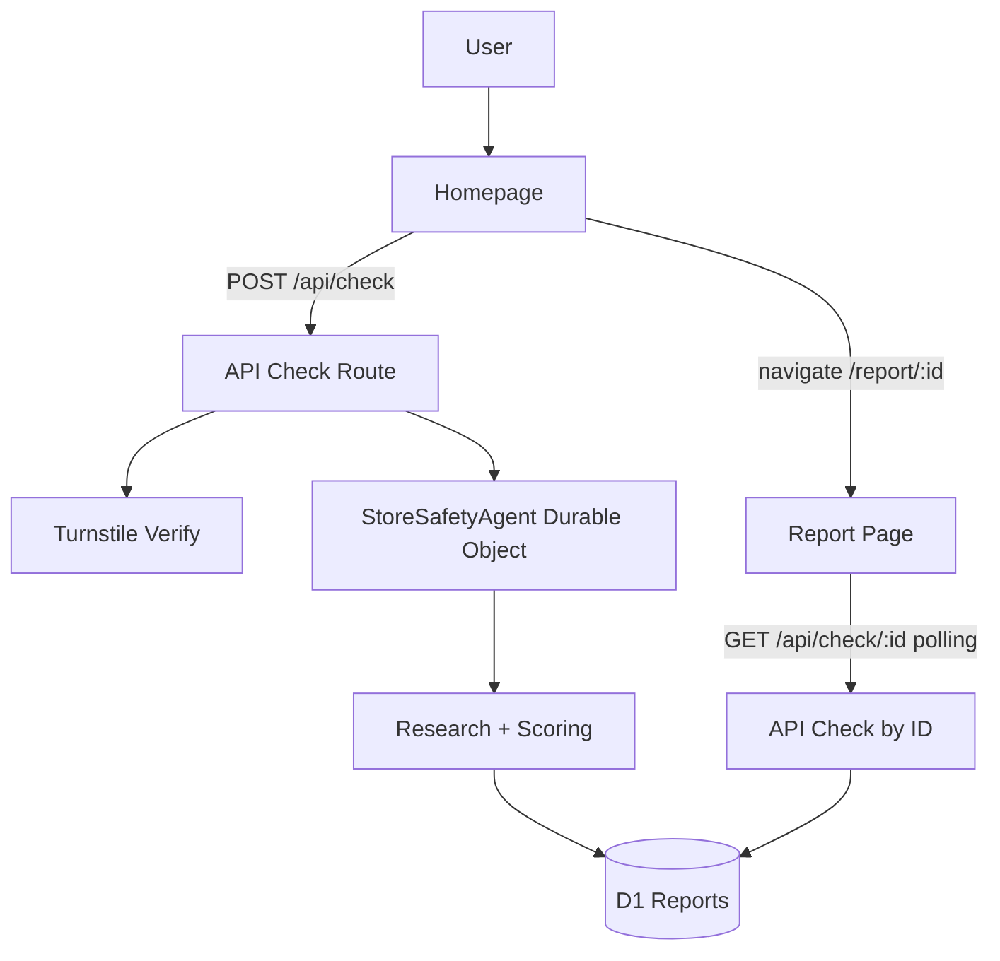

# IsSafe.store

IsSafe.store helps people check a store before paying.  
Paste a store URL to get a risk score, confidence rating, recommendation, and cited public evidence.

This is a public-signal risk assessment. It does **not** guarantee merchant, purchase, or delivery safety.

## What You Get

- **Risk score (`0-100`)**: Higher score means lower visible risk.
- **Confidence score (`0-100`)**: How confident the system is in the result.
- **Recommendation**: `likely-safe`, `caution`, `avoid`, or `unknown`.
- **Evidence**: Cited signals from store pages, domain metadata, and external reputation checks.

## Tech Stack

- **Frontend/App framework**: TanStack Start + React
- **Styling**: Tailwind CSS v4
- **Runtime**: Cloudflare Workers
- **Stateful orchestration**: Cloudflare Agents + Durable Objects (`StoreSafetyAgent`)
- **Persistence**: Cloudflare D1
- **Model summary generation**: Workers AI (`AI` binding)
- **Bot protection**: Cloudflare Turnstile
- **External reputation search**: Tavily

## Quickstart

### Prerequisites

- [Bun](https://bun.sh/)
- Cloudflare account
- Wrangler CLI auth (`wrangler login`)

### Install

```bash
bun install
```

### Run locally

```bash
bun run dev
```

App URL: [http://localhost:3000](http://localhost:3000)

### Run tests

```bash
bun run test
```

### Build

```bash
bun run build
```

## Environment and Configuration

### Non-secret vars (`wrangler.jsonc` -> `vars`)

- `AI_MODEL` (default: `@cf/zai-org/glm-4.7-flash`)
- `CACHE_TTL_SECONDS` (default: `604800`)
- `TURNSTILE_SITE_KEY` (empty disables Turnstile on UI)

### Secrets (set with Wrangler)

```bash
bunx wrangler secret put GOOGLE_WEB_RISK_API_KEY
bunx wrangler secret put URLHAUS_AUTH_KEY
bunx wrangler secret put TAVILY_API_KEY
bunx wrangler secret put TURNSTILE_SECRET_KEY
```

Behavior notes:

- If `TURNSTILE_SECRET_KEY` is missing, backend verification is skipped.
- If `TAVILY_API_KEY` is missing, external web reputation signals are reduced.
- If `URLHAUS_AUTH_KEY` is missing, URLhaus malware checks are skipped.
- Phishing URL overlap is checked against the public [OpenPhish feed](https://raw.githubusercontent.com/openphish/public_feed/refs/heads/main/feed.txt) (no API key).
- If `GOOGLE_WEB_RISK_API_KEY` is missing, Google Web Risk threat-list checks are skipped.
- Domain registration age is checked through public RDAP over HTTPS (no API key).

### Cloudflare bindings used

- `StoreSafetyAgent` (Durable Object binding)
- `DB` (D1 database binding)
- `AI` (Workers AI binding)
- `CHECK_RATE_LIMIT` (Cloudflare rate limiting binding)

## Project Structure

```text
src/
  routes/
    index.tsx               # Homepage (submit URL, start check)
    report.$id.tsx          # Report page + polling
    api/
      config.ts             # GET /api/config
      check.ts              # POST /api/check
      check.$id.ts          # GET /api/check/:id
  agents/
    store-safety-agent.ts   # Durable Object agent lifecycle/state
  lib/
    checks.ts               # Start/read checks, cache behavior
    research.ts             # Evidence collection pipeline
    scoring.ts              # Deterministic score logic
    turnstile.ts            # Turnstile verification
    reports-db.ts           # D1 persistence access
  server.ts                 # Worker fetch entry + agent routing
migrations/
  0001_reports.sql          # D1 schema
wrangler.jsonc             # Worker config and bindings
```

## Architecture and Request Flow



Core behavior:

1. User submits a store URL on homepage.
2. `POST /api/check` rate-limits, validates Turnstile, and starts or reuses a check.
3. Agent gathers evidence and computes deterministic score.
4. Report is stored in D1 and returned by report ID.
5. Report page polls `GET /api/check/:id` while status is still in progress.

## API Endpoints (Reference)

### `GET /api/config`

Returns public runtime config for frontend.

- Response:
  - `turnstileSiteKey: string | null`

### `POST /api/check`

Starts a new store check (or returns cached result).

- Body:
  - `url: string`
  - `turnstileToken?: string`
- Success response:
  - `report: StoreSafetyReport`
  - `cached: boolean`
  - `turnstileSkipped?: boolean`
- Common errors:
  - `429`: Too many checks
  - `403`: Turnstile verification failed
  - `400`: Invalid/missing URL or validation failure

### `GET /api/check/:id`

Returns latest report state for a check ID.

- Success:
  - `report: StoreSafetyReport`
  - `cached: boolean`
- Error:
  - `404`: Check not found

## Deployment

### 1) Create D1 database

```bash
bunx wrangler d1 create issafe-store
```

Update `wrangler.jsonc` with the real `database_id`.

### 2) Apply D1 migrations

```bash
bunx wrangler d1 migrations apply issafe-store
```

### 3) Set required secrets

```bash
bunx wrangler secret put GOOGLE_WEB_RISK_API_KEY
bunx wrangler secret put URLHAUS_AUTH_KEY
bunx wrangler secret put TAVILY_API_KEY
bunx wrangler secret put TURNSTILE_SECRET_KEY
```

### 4) Set `TURNSTILE_SITE_KEY`

Set `TURNSTILE_SITE_KEY` in `wrangler.jsonc` after creating your Turnstile widget.

### 5) Deploy

```bash
bun run deploy
```

### 6) Post-deploy sanity checks

- Homepage loads and accepts URL input
- `POST /api/check` returns a report ID
- Report page updates from in-progress to final status
- Turnstile challenge appears (if site key is configured)

## Troubleshooting

- **`Check not found` on report page**  
  Verify check ID exists and D1 binding/migrations are correct.

- **Turnstile errors in `POST /api/check`**  
  Confirm both `TURNSTILE_SITE_KEY` (var) and `TURNSTILE_SECRET_KEY` (secret) are configured.

- **No external reputation signals**  
  Confirm `TAVILY_API_KEY` secret is set.

- **Threat-list checks unavailable**  
  Confirm `URLHAUS_AUTH_KEY` and `GOOGLE_WEB_RISK_API_KEY` secrets are set, and that Google Web Risk API is enabled for the key's Google Cloud project. OpenPhish uses a public feed; if that fetch fails, the check is skipped for scoring.

- **Rate limit hits in development**  
  `CHECK_RATE_LIMIT` is active; wait for the window to reset or adjust configuration for your environment.

## Safety and Limitations

IsSafe.store provides a practical risk signal using public data.  
It should support a buying decision, not replace independent judgment.
