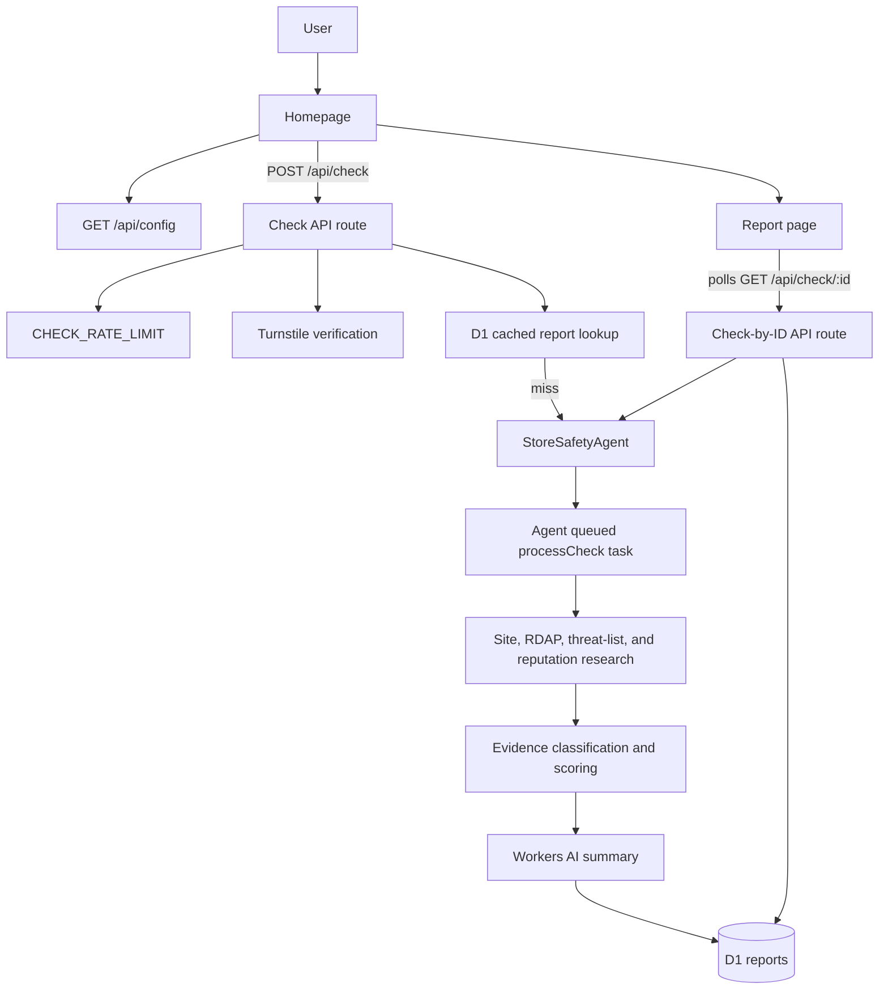

# IsSafe.store

## Intro

IsSafe.store helps people check an online store before paying. Paste a store URL to get a risk score, confidence rating, recommendation, and cited public evidence from the store site, domain registration data, public threat lists, and external reputation signals.

The result is a public-signal risk assessment. It does not guarantee merchant, purchase, or delivery safety.

## Tech Stack

- **App framework**: TanStack Start, TanStack Router, React 19, Vite
- **Language**: TypeScript
- **Styling**: Tailwind CSS v4
- **Runtime and deploy target**: Cloudflare Workers
- **Stateful orchestration**: Cloudflare Agents and Durable Objects (`StoreSafetyAgent`)
- **Persistence**: Cloudflare D1
- **AI summary generation**: Workers AI (`AI` binding)
- **Bot protection**: Cloudflare Turnstile
- **Rate limiting**: Cloudflare Workers rate limiting binding (`CHECK_RATE_LIMIT`)
- **External checks**: Tavily, Google Web Risk, URLhaus, OpenPhish, RDAP
- **Testing**: Vitest and Testing Library
- **Package manager**: Bun

## Quickstart

Prerequisites:

- Bun
- Cloudflare account
- Wrangler CLI authentication (`wrangler login`)

Install dependencies:

```bash
bun install
```

Run the app locally:

```bash
bun run dev
```

Local app URL:

```text
http://localhost:3000
```

Run tests:

```bash
bun run test
```

Build:

```bash
bun run build
```

Deploy:

```bash
bun run deploy
```

Cloudflare configuration lives in `wrangler.jsonc`. It defines the Worker entrypoint, Durable Object binding, D1 binding, Workers AI binding, rate limit, and public vars:

- `AI_MODEL`
- `CACHE_TTL_SECONDS`
- `TURNSTILE_SITE_KEY`

Secrets are configured with Wrangler:

```bash
bunx wrangler secret put GOOGLE_WEB_RISK_API_KEY
bunx wrangler secret put URLHAUS_AUTH_KEY
bunx wrangler secret put TAVILY_API_KEY
bunx wrangler secret put TURNSTILE_SECRET_KEY
```

Optional behavior:

- Missing `TURNSTILE_SECRET_KEY` skips backend Turnstile verification.
- Missing `TAVILY_API_KEY` reduces external reputation evidence.
- Missing `URLHAUS_AUTH_KEY` skips URLhaus malware checks.
- Missing `GOOGLE_WEB_RISK_API_KEY` skips Google Web Risk checks.
- OpenPhish and RDAP checks use public HTTPS sources and do not need API keys.

## Project Structure

```text
src/
  agents/
    store-safety-agent.ts   # Cloudflare Agent/Durable Object check lifecycle
  components/
    BrandLogo.tsx           # Brand mark
    Footer.tsx              # App footer
    Header.tsx              # App header
    ReportView.tsx          # Report presentation and status UI
    ThemeToggle.tsx         # Theme control
    TurnstileWidget.tsx     # Turnstile client widget
  lib/
    checks.ts               # Check start/read orchestration and cache keying
    http.ts                 # JSON/error response helpers
    reports-db.ts           # D1 report persistence
    research.ts             # Evidence collection pipeline
    scoring.ts              # Deterministic scoring and classification helpers
    turnstile.ts            # Turnstile verification
    url.ts                  # Store URL normalization and validation
  routes/
    __root.tsx              # Root layout
    about.tsx               # About page
    index.tsx               # Homepage and check form
    report.$id.tsx          # Report page with polling
    api/
      config.ts             # GET /api/config
      check.ts              # POST /api/check
      check.$id.ts          # GET /api/check/:id
  types/
    report.ts               # Report and evidence types
  router.tsx                # TanStack router setup
  routeTree.gen.ts          # Generated route tree
  server.ts                 # Worker fetch entrypoint and agent routing
  styles.css                # Global styles
migrations/
  0001_reports.sql          # D1 reports schema
public/
  favicon.ico
  logo.svg
  logo192.png
  logo512.png
  manifest.json
  robots.txt
  sitemap.xml
vite.config.ts             # Vite, TanStack Start, Tailwind, Cloudflare setup
wrangler.jsonc             # Cloudflare Worker, bindings, vars, observability
```

## Architecture

IsSafe.store runs as a TanStack Start app on Cloudflare Workers. `src/server.ts` first lets the Agents SDK route Durable Object agent requests, then falls back to the TanStack Start request handler for pages and API routes.



Request flow:

1. The homepage fetches `/api/config` for the public Turnstile site key.
2. A user submits a store URL to `POST /api/check`.
3. The API route rate-limits by connecting IP, verifies Turnstile when configured, normalizes the URL, and checks D1 for a cached report.
4. On a cache miss, `StoreSafetyAgent` creates a queued report and processes the check asynchronously.
5. The research pipeline collects store-page signals, RDAP registration data, threat-list matches, and external reputation evidence.
6. The scoring layer deduplicates and classifies evidence, computes score/confidence/recommendation, and uses Workers AI to summarize the result.
7. Completed reports are saved to D1 with an expiration timestamp.
8. The report page polls `GET /api/check/:id` until the status is complete or failed.
